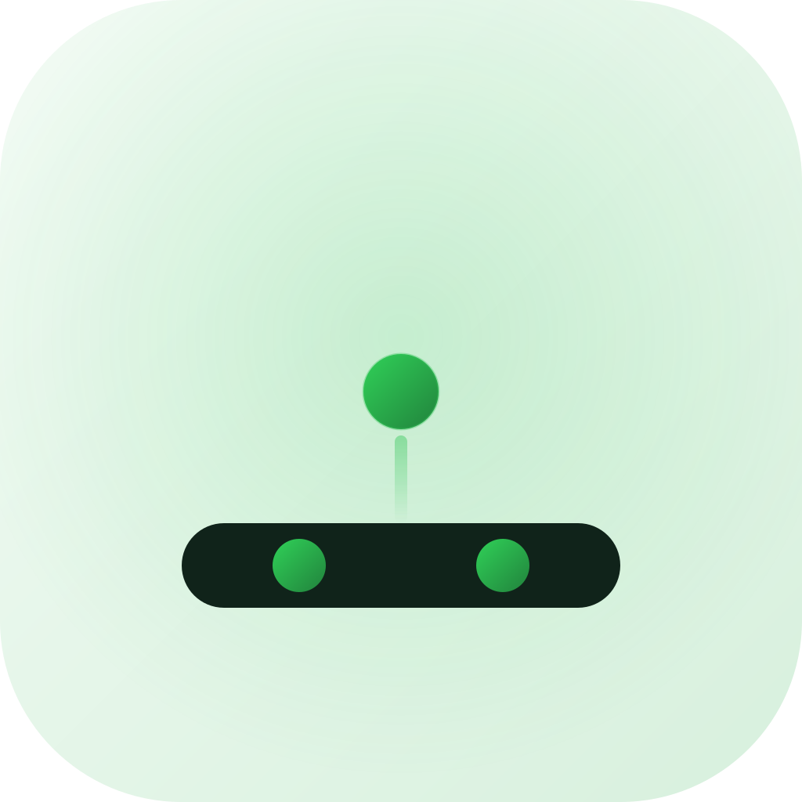

# PodDock

<p align="center">
  
</p>

Native DNSPod client in Swift: a macOS/iOS app plus an independently deployable MCP server — one codebase, three delivery forms.

## Features

- Multi-account token management (Keychain storage, optional Face ID / Touch ID app lock)
- Full CRUD for domains and DNS records — pause/resume, remarks, search, type filtering, sorting, batch operations
- DoH propagation check (defaults to Tencent doh.pub / Ali alidns, customizable)
- LLM assistant: edit DNS in natural language ("point www's A record to 1.2.3.4") — executes locally, destructive operations require confirmation
- MCP server ([Model Context Protocol](https://modelcontextprotocol.io/)): Streamable HTTP only, **zero startup credentials** — clients authenticate by calling the `dnspod_login` tool inside their session, credentials stay bound to that session; the same service library powers two hosts (standalone Linux deployment / embedded in the macOS app)

## Architecture

```text
DNSPodKit (SPM package)
├── DNSPodKit library   # intent-level DNSPodClient protocol + LegacyClient (legacy API) + DoH, zero dependencies
├── PodDockMCP library  # MCP Streamable HTTP service; inject any DNSPodClient and it works
└── poddock-mcp         # standalone Linux executable (Docker)

PodDock (app)           # SwiftUI multiplatform (macOS first), @Observable MV
```

The API layer is a dual-implementation adapter: v1 ships the legacy API (`dnsapi.cn` + `login_token`), with a slot reserved for Tencent Cloud API 3.0 (TC3 signing).

## Documentation

- [DEVELOPMENT.md](DEVELOPMENT.md) — building, IDE setup, release pipeline and its secrets
- [docs/PLAN.md](docs/PLAN.md) — milestones and architecture decisions

## Status

Work in progress.

## LICENSE

Apache-2.0 (ported from the API reference of [dnspod-api-python-web](https://github.com/likexian/dnspod-api-python-web))
